# QA Pipeline

An integrated QA track embedded in the `sf-ticket-to-pr` dev workflow. It generates abstract test scenarios before dev work begins, then materializes them into concrete data and E2E checks after dev, fixes code-level failures inline, and posts a structured QA report — all triggered automatically by the same `@butler` mention.

- [Pipeline](#pipeline)
- [Jobs](#jobs)
- [How QA runs inside execute](#how-qa-runs-inside-execute)
- [Skills](#skills)
- [Type modules](#type-modules)
- [Shared modules](#shared-modules)
- [Artifacts](#artifacts)
- [QA report format](#qa-report-format)
- [Adding a new type](#adding-a-new-type)
- [Configuration](#configuration)

---

## Pipeline

```mermaid
graph LR
    T[triage] -->|proceed=true| E[execute]
    E --> SG[Scenario gen]
    SG --> D[Dev work]
    D --> M[Metadata query]
    M --> DF[Dev-fix]
    DF --> QE[QA eval]
    QE --> R[QA report on PR/issue]

    style T fill:#f9f,stroke:#333
    style E fill:#bbf,stroke:#333
    style SG fill:#bfb,stroke:#333
    style D fill:#bbf,stroke:#333
    style M fill:#ddd,stroke:#333
    style DF fill:#bfb,stroke:#333
    style QE fill:#bfb,stroke:#333
    style R fill:#ff9,stroke:#333
```



The pipeline runs **2 jobs**: triage and execute. Scenario generation happens before dev work so the dev agent builds solutions informed by what QA will verify. After dev, a dev-fix agent materializes scenarios into concrete checks, runs them, fixes code-level failures, and writes results. A separate evaluator posts the final report.

---

## Jobs

### triage

Reads the issue thread, decides whether to proceed. Posts a plan comment. Unchanged from the base `sf-ticket-to-pr` workflow.

### execute

Generates scenarios, does the dev work, then runs QA inline:

1. **Generate QA scenarios** (qa-plan skill, 15 turns) — reads the issue and triage plan, detects Salesforce types, generates abstract test scenarios (S-NNN) with categories. No org metadata, no SOQL. Writes to `/tmp/test-scenarios.md`.
2. **Dev work** — Claude agent implements the ticket against the scratch org. Receives `/tmp/test-scenarios.md` as read-only context so it can build solutions that handle negative cases, boundaries, and bulk.
3. **Query org metadata** — shell step greps the triage plan + `/tmp/test-scenarios.md` for Salesforce object names, runs `sf sobject describe` + `jq` to extract field metadata to `/tmp/org-metadata.txt`.
4. **Pre-install Playwright** — `npm install --no-save playwright` for E2E scripts.
5. **Generate frontdoor URL** — `sf org open --url-only` + `sf org display` for instance URL. Required for E2E authentication.
6. **Dev self-check and fix** (qa-run skill, 55 turns) — materializes abstract scenarios into concrete checks using org metadata. Runs Phase 1 data checks (SOQL) and Phase 2 E2E checks (Playwright Node.js scripts). Fixes code-level failures (max 1 attempt per check). Outputs PASS/FAIL/UNRESOLVED per scenario.
7. **Evaluate and post QA report** (qa-eval, 30 turns) — reads results, classifies failures and unresolved items, posts the QA report.
8. **Upload screenshots** — as GitHub Actions artifacts.

QA failures are **advisory** — they produce warning annotations but don't fail the execute job. The job only fails if dev work failed.

---

## How QA runs inside execute

### Scenario Generation (qa-plan step)

Runs **before** dev work. The qa-plan agent reads the issue body and triage plan, detects Salesforce metadata types using the shared type-detection module, loads type-specific `plan.md` patterns, and generates abstract test scenarios.

Abstract scenarios describe *what* to verify in plain language — no field API names, no SOQL, no record IDs. Each scenario has an S-NNN identifier and a category (positive, negative, boundary, bulk, data-integrity, e2e). The `e2e` category hints which scenarios benefit from UI verification, but the dev-fix agent makes the final decision during materialization.

Falls back gracefully — if scenario generation fails (`continue-on-error: true`), the dev agent proceeds without scenarios and the dev-fix agent generates checks from the issue and triage plan directly.

### Materialization + Data Checks (dev-fix Phase 1)

The dev-fix agent reads the abstract scenarios from `/tmp/test-scenarios.md` and org metadata from `/tmp/org-metadata.txt`. For each data-category scenario it:

1. **Materializes** the abstract scenario into a concrete SOQL check using org metadata field names, types, and picklist values.
2. **Creates test data** via `sf data create record` per type-specific `data.md` patterns (batched where possible).
3. **Runs the check** — SOQL assertion per `run.md` Phase 1 patterns.
4. **Fixes** if the check fails with a code-level issue — modifies source code, re-deploys (`sf project deploy`), and re-runs the check **once**.
5. **Records** PASS, FAIL, or UNRESOLVED to `/tmp/qa-results.json` incrementally.

If more than 50% of data checks fail, Phase 2 (E2E) is skipped.

### E2E Checks (dev-fix Phase 2)

The agent writes a **single Node.js Playwright script** that:
- Launches Chromium at `/usr/bin/chromium` (pre-installed on the runner)
- Authenticates **once** via the pre-generated frontdoor URL
- Navigates directly to record pages using `${instanceUrl}/lightning/r/<Object>/<Id>/view`
- Reuses record IDs from Phase 1 data checks (no redundant record creation)
- Uses proven patterns from type-specific `run.md` modules for Lightning wait strategies
- Wraps each scenario in try/catch (failures don't abort remaining scenarios)
- Captures screenshots to `/tmp/qa-screenshots/`

Playwright MCP is **not used in CI** — `mcp_servers: []` on every run due to an OAuth token limitation in `claude-code-action`. The `.claude/mcp.json` config remains for local development only. The dev agent also cannot use Playwright in CI for the same reason, so QA's Node.js scripts are the only UI verification path.

### Fix Loop

When a data check or E2E check fails, the dev-fix agent:

1. Analyzes the failure — distinguishes code-level bugs (missing trigger criteria, wrong field reference) from environment issues (org state, flakiness).
2. For code-level failures: modifies the source code, re-deploys to the scratch org, and re-runs the check **once**.
3. If the re-run passes, the scenario is recorded as PASS.
4. If the re-run still fails, the scenario is recorded as **UNRESOLVED** — the check failed, a fix was attempted, but the issue persists.
5. The agent moves on to the next scenario. No further retries.

The max-1-attempt limit prevents the dev-fix agent from burning its turn budget on a single stubborn failure. UNRESOLVED scenarios surface in the QA report with details about what was tried.

### Evaluation (separate invocation)

A second `claude-code-action` invocation (qa-eval, 30 turns) reads `/tmp/qa-results.json`, classifies failures by root cause using type-specific eval modules, generates the QA report, and posts it. This separation guarantees the report is posted even if the dev-fix step exhausted its turn budget.

Results are written incrementally — if dev-fix is interrupted, qa-eval receives all completed scenarios. The evaluator handles three result statuses: PASS, FAIL, and UNRESOLVED. UNRESOLVED items are reported with fix attempt details so humans can assess whether a re-trigger is worthwhile.

### Labels

- **`qa-findings`**: Applied when any test fails or is unresolved. Removed when all pass on re-run.
- **`qa-fix-needed`**: Applied when failures have code-level root causes (not environment/flakiness). Signals to humans that a re-trigger of `@butler` may fix the issue.

---

## Skills

| Skill | What it does |
|---|---|
| [qa-plan](.claude/skills/qa-plan/SKILL.md) | Reads issue requirements, detects SF types, generates abstract test scenarios (S-NNN) with categories. No org metadata, no SOQL. |
| [qa-run](.claude/skills/qa-run/SKILL.md) | Materializes abstract scenarios into concrete checks using org metadata. Runs data checks (SOQL) and E2E (Playwright). Fixes code-level failures (max 1 attempt). Outputs PASS/FAIL/UNRESOLVED per scenario. |
| [qa-eval](.claude/skills/qa-eval/SKILL.md) | Evaluates results using type-specific root cause patterns, generates the QA report, posts to PR/issue, manages `qa-findings` and `qa-fix-needed` labels. Handles UNRESOLVED status with fix attempt details. |

---

## Type modules

Each supported Salesforce metadata type has 4 module files in `.claude/skills/_qa-types/<type>/`:

| Module | Phase | Purpose |
|--------|-------|---------|
| `plan.md` | qa-plan (scenario gen) | Test scenario patterns, boundary conditions, subtypes |
| `data.md` | qa-run (dev-fix) Phase 1 | Test data creation, DML triggers, bulk patterns |
| `run.md` | qa-run (dev-fix) Phase 1+2 | SOQL assertions (Phase 1) and Playwright patterns (Phase 2) for Lightning interactions |
| `eval.md` | qa-eval | Root cause categories, severity defaults, fix suggestions |

### Supported types

| Type | Directory | Testing focus |
|------|-----------|---------------|
| **Flow** | `_qa-types/flow/` | Record-triggered DML, field updates, child record creation, bulk (200 records), boundary conditions, before/after save |
| **Prompt Template** | `_qa-types/prompt-template/` | API invocation, merge field resolution, output quality, empty/null inputs, format compliance |
| **Agentforce** | `_qa-types/agentforce/` | Topic routing, action invocation, multi-turn conversations, guardrails, context grounding, escalation |

---

## Shared modules

Located in `.claude/skills/_qa-shared/`:

| Module | Purpose |
|--------|---------|
| [type-detection.md](.claude/skills/_qa-shared/type-detection.md) | Keyword matching rules to infer metadata types from issue text. Handles ambiguity (e.g., "Agent" only maps to Agentforce if co-occurring with "topic" or "action"). |
| [type-registry.md](.claude/skills/_qa-shared/type-registry.md) | Maps type names to module paths. Used by all skills to locate type-specific logic. |
| [sf-assertions.md](.claude/skills/_qa-shared/sf-assertions.md) | Reusable SOQL assertion patterns: record exists, field changed, record count, related records, negative tests. |
| [sf-reporting.md](.claude/skills/_qa-shared/sf-reporting.md) | QA report Markdown template, artifact link instructions for screenshots, `qa-findings` and `qa-fix-needed` label logic. Includes fix attempt details and UNRESOLVED status. |

---

## Artifacts

| Artifact | Produced by | Contents | Retention |
|----------|-------------|----------|-----------|
| `qa-screenshots` | execute (dev-fix Phase 2) | PNG screenshots from Playwright E2E checks (one per assertion point) | 30 days |

Screenshots are downloadable from the GitHub Actions run page. The QA report links to the Actions artifacts page (not relative paths).

---

## QA report format

```markdown
## QA Report — Issue #42

**Result**: PASS | **Pass rate**: 10/12 (83%) | **Unresolved**: 1

### Data Checks
| # | Scenario | Result | Fix Attempted | Details |
|---|----------|--------|---------------|---------|
| S-001 | Owner task created on Closed Won | PASS | — | Subject, OwnerId, ActivityDate all match |
| S-003 | Amount = $100K — no VP task | PASS | Yes (fixed entry criteria) | Originally failed, fix resolved it |
| S-005 | Null Amount — flow should not fire | UNRESOLVED | Yes (added null guard) | Re-run still fails, task created unexpectedly |

### E2E Checks

Screenshots available in the [Actions artifacts](https://github.com/owner/repo/actions/runs/12345)

| # | Scenario | Result | Fix Attempted | Screenshot | Details |
|---|----------|--------|---------------|------------|---------|
| S-008 | Happy path — task visible in UI | PASS | — | see artifacts | Activity timeline shows task |

### Failures
_(only present if tests failed or are unresolved)_

#### Root Cause 1: Missing null guard in entry criteria
**Severity**: High
**Scenarios**: S-005 (UNRESOLVED)
**Summary**: Flow fires when Amount is null — entry condition `Amount > 100000` evaluates to true for null values
**Fix attempted**: Added `ISBLANK(Amount)` guard — still fails, likely a formula evaluation order issue
**Evidence**: SOQL returned 1 Task after DML insert with null Amount
```

When failures exist, the issue is labeled `qa-findings`. When code-level failures exist, the issue is also labeled `qa-fix-needed`. When all tests pass on a subsequent run, both labels are removed.

---

## Adding a new type

1. **Create the module directory**:
   ```
   .claude/skills/_qa-types/<type-key>/
   ├── plan.md    # Scenario patterns for qa-plan (scenario gen)
   ├── data.md    # Test data creation for qa-run (dev-fix) Phase 1
   ├── run.md     # SOQL assertions + Playwright patterns for qa-run (dev-fix)
   └── eval.md    # Root cause categories for qa-eval
   ```

2. **Add detection keywords** to [type-detection.md](.claude/skills/_qa-shared/type-detection.md) — list the primary keywords, context rules, and ambiguity handling for the new type.

3. **Register the type** in [type-registry.md](.claude/skills/_qa-shared/type-registry.md) — add a row to the registry table with the type key and module path.

4. **Test it** — create an issue mentioning the new type, trigger `@butler`, and verify qa-plan detects the type and generates appropriate scenarios.

Use the existing Flow modules as a reference — they're the most complete example.

---

## Configuration

All configuration is in [.github/workflows/sf-ticket-to-pr.yml](.github/workflows/sf-ticket-to-pr.yml).

| Setting | Location | Current value |
|---------|----------|---------------|
| Model (qa-plan / scenario gen) | "Generate QA scenarios" step `claude_args` | `claude-sonnet-4-6` |
| Model (qa-run / dev-fix) | "Dev self-check and fix" step `claude_args` | `claude-sonnet-4-6` |
| Model (qa-eval) | "Evaluate and post QA report" step `claude_args` | `claude-sonnet-4-6` |
| Max turns (qa-plan / scenario gen) | "Generate QA scenarios" step `claude_args` | 15 |
| Max turns (qa-run / dev-fix) | "Dev self-check and fix" step `claude_args` | 55 |
| Max turns (qa-eval) | "Evaluate and post QA report" step `claude_args` | 30 |
| Screenshot retention | "Upload QA screenshots" step `retention-days` | 30 days |

### Cost

Each `@butler` mention triggers up to 4 Claude invocations:

| Invocation | Typical cost | Tokens |
|-----------|-------------|--------|
| triage | ~$0.10 | ~200K |
| execute (scenario gen) | ~$0.15 | ~150K |
| execute (dev) | ~$2.50 | ~5M |
| execute (dev-fix) | ~$1.50 | ~3M |
| execute (qa-eval) | ~$0.25 | ~400K |
| **Total** | **~$4.50** | **~8.75M** |

Costs vary by issue complexity. The triage job is cheap — if it refuses or asks for clarification, only ~$0.10 is spent. QA costs are only incurred if dev work succeeds. The v2 pipeline is slightly cheaper than v1 because scenario generation (15 turns, no SOQL) is lighter than the old qa-plan (15 turns with metadata queries), and dev-fix (55 turns) replaces qa-run (75 turns) by combining materialization, execution, and fixing in one session.

### Architecture decisions

| Decision | Rationale |
|----------|-----------|
| Scenario gen before dev | Dev agent receives abstract scenarios as context, so it builds solutions that handle negative cases, boundaries, and bulk from the start — reducing failures caught only at QA time. |
| Dev-fix materializes + runs + fixes in one session | Single agent session holds the full context: abstract scenarios, org metadata, source code, and test data. Eliminates the handoff overhead of separate qa-plan and qa-run invocations. |
| Max 1 fix attempt per check | Prevents the dev-fix agent from burning its 55-turn budget on a single stubborn failure. Unresolved items surface in the report for human review. |
| E2E retained — dev agent can't use Playwright in CI | MCP server never starts in `claude-code-action` with OAuth tokens (`mcp_servers: []`). The dev agent has no Playwright access. QA's Node.js scripts are the only UI verification path. |
| QA inline in execute (2-job pipeline) | Reuses the same scratch org. Scenario gen and dev-fix get org access. No artifact polling needed. |
| Pre-query org metadata in shell step | Shell steps have no permission restrictions. Greps triage plan + scenario file for object names, runs `sf sobject describe` + `jq`. Agent reads the file — no permission issues, saves turns. |
| Split dev-fix and qa-eval into two invocations | Guarantees the report is always posted. Dev-fix can exhaust turns on checks and fixes without losing the report. |
| Playwright via Node.js scripts (not MCP) | MCP server never starts in `claude-code-action` with OAuth tokens (`mcp_servers: []`). Scripts are reliable and deterministic. |
| Copy-paste Playwright templates in skill modules | Agent copies a complete, runnable script template from `run.md`, fills in the scenario array. Eliminates setup debugging (chromium path, imports, wait strategies). |
| Batched data test operations | Agent creates all test records first, then runs all assertions. Reduces turns per scenario. |
| Pre-generate frontdoor URL in shell step | `sf org open` is not in the agent's permission set. Shell steps have no restrictions. |
| Screenshot links to Actions artifacts | Relative paths don't work in issue comments. Artifact page URLs work everywhere. |
| Single browser session for all E2E scenarios | One login instead of N. Direct record URLs instead of UI navigation. ~30% faster. |
| Incremental result writing | Dev-fix overwrites `/tmp/qa-results.json` after each scenario. Partial results survive interruptions. |
| `qa-fix-needed` label for code-level failures | Distinguishes actionable bugs from environment flakiness. Humans decide whether to re-trigger `@butler`. |
| Abstract scenarios use S-NNN IDs | Unified numbering instead of DT-NNN/ET-NNN. The dev-fix agent decides data vs E2E during materialization based on scenario category. |
