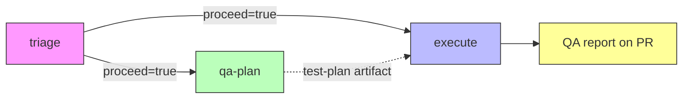

# QA Pipeline

An independent QA track that shadows the `sf-ticket-to-pr` dev workflow. It generates a test plan from the issue requirements (not from the code), runs data and UI tests against the scratch org, and posts a structured QA report with screenshots — all triggered automatically by the same `@butler` mention.

- [Pipeline](#pipeline)
- [Jobs](#jobs)
- [Skills](#skills)
- [Type modules](#type-modules)
- [Shared modules](#shared-modules)
- [Artifacts](#artifacts)
- [QA report format](#qa-report-format)
- [Adding a new type](#adding-a-new-type)
- [Configuration](#configuration)

---

## Pipeline



`execute` and `qa-plan` run **in parallel** after triage. After dev work completes, the execute job polls for the test plan artifact from qa-plan, then runs QA tests inline using the same scratch org session — no separate job needed.

The triage job is unchanged. The execute job now handles both dev work and QA testing.

---

## Jobs

### qa-plan

**Trigger**: `needs.triage.outputs.proceed == 'true'`
**Runs on**: `ubuntu-latest` (no scratch org, no SF CLI)
**Duration**: ~2 minutes
**Model**: `claude-sonnet-4-6`, 15 max-turns

Reads the issue requirements and triage plan comment, detects which Salesforce metadata types are involved (Flow, Prompt Template, Agentforce), loads type-specific planning modules, and generates a structured test plan with numbered scenarios. Posts a summary comment on the issue ("QA plan: 12 test scenarios covering flow...").

**Outputs**: `test-plan` artifact (Markdown file uploaded via `actions/upload-artifact`)

### execute (QA phase)

After the dev work completes, the execute job polls for the `test-plan` artifact from qa-plan (30s interval, 10 min timeout). Once downloaded, it runs a second `claude-code-action` invocation with the qa-run and qa-eval skills:

1. **Data tests** (Phase 1) — Creates test data via `sf data create record`, triggers automations via DML, asserts outcomes via SOQL queries. Uses the same scratch org already authenticated for dev work.
2. **E2E tests** (Phase 2) — Logs into the scratch org via frontdoor URL, drives the Lightning UI with Playwright, captures screenshots at assertion points. Skipped if >50% of data tests failed.
3. **Evaluation** (Phase 3) — Compares actual vs expected, groups failures by root cause, classifies severity, generates the QA report, posts it on the PR/issue.

QA failures are **advisory** — they produce warning annotations but don't fail the execute job. The job only fails if dev work failed.

**Outputs**: `qa-screenshots` artifact, QA report comment on PR/issue, `qa-findings` label if failures found

---

## Skills

| Skill | What it does |
|---|---|
| [qa-plan](.claude/skills/qa-plan/SKILL.md) | Reads issue requirements, detects SF metadata types, loads type-specific patterns, generates a test plan with DT-NNN (data) and ET-NNN (e2e) scenarios. No org needed. |
| [qa-run](.claude/skills/qa-run/SKILL.md) | Executes the test plan against the scratch org. Phase 1: data tests via SOQL/API. Phase 2: e2e tests via Playwright with screenshots. Outputs pass/fail per scenario. |
| [qa-eval](.claude/skills/qa-eval/SKILL.md) | Evaluates results using type-specific root cause patterns, generates the QA report, posts to PR/issue, uploads screenshots, manages `qa-findings` label. |

---

## Type modules

Each supported Salesforce metadata type has 4 module files in `.claude/skills/_qa-types/<type>/`:

| Module | Phase | Purpose |
|--------|-------|---------|
| `plan.md` | qa-plan | Test scenario patterns, boundary conditions, subtypes |
| `data.md` | qa-run Phase 1 | Test data creation, DML triggers, bulk patterns |
| `run.md` | qa-run Phase 1+2 | SOQL assertions, Playwright navigation, screenshot points |
| `eval.md` | qa-eval | Root cause categories, severity defaults, fix suggestions |

### Supported types

| Type | Directory | Testing focus |
|------|-----------|---------------|
| **Flow** | `_qa-types/flow/` | Record-triggered DML, field updates, child record creation, bulk (200 records), boundary conditions, before/after save |
| **Prompt Template** | `_qa-types/prompt-template/` | API invocation, merge field resolution, output quality, empty/null inputs, format compliance |
| **Agentforce** | `_qa-types/agentforce/` | Topic routing, action invocation, multi-turn conversations, guardrails, context grounding, escalation |

---

## Shared modules

Located in `.claude/skills/_qa-shared/`:

| Module | Purpose |
|--------|---------|
| [type-detection.md](.claude/skills/_qa-shared/type-detection.md) | Keyword matching rules to infer metadata types from issue text. Handles ambiguity (e.g., "Agent" only maps to Agentforce if co-occurring with "topic" or "action"). |
| [type-registry.md](.claude/skills/_qa-shared/type-registry.md) | Maps type names to module paths. Used by all skills to locate type-specific logic. |
| [sf-assertions.md](.claude/skills/_qa-shared/sf-assertions.md) | Reusable SOQL assertion patterns: record exists, field value changed, record count, related records, negative tests. |
| [sf-reporting.md](.claude/skills/_qa-shared/sf-reporting.md) | QA report Markdown template, screenshot commit instructions, video upload instructions, `qa-findings` label logic. |

---

## Artifacts

| Artifact | Produced by | Contents | Retention |
|----------|-------------|----------|-----------|
| `test-plan` | qa-plan | Markdown file with metadata, DT-NNN data scenarios, ET-NNN e2e scenarios | 30 days |
| `qa-screenshots` | execute (QA phase) | PNG screenshots from Playwright e2e tests (one per assertion point) | 30 days |

Both are downloadable from the GitHub Actions run page.

The QA report itself is posted as a **comment** on the PR or issue — not an artifact.

---

## QA report format

```markdown
## QA Report — Issue #42

**Result**: PASS | **Pass rate**: 12/12 (100%)

### Data Tests
| # | Scenario | Result | Details |
|---|----------|--------|---------|
| DT-001 | Owner task created on Closed Won | PASS | Subject, OwnerId, ActivityDate all match |
| DT-005 | Amount = $100K — no VP task | PASS | Exactly 1 task, GreaterThan excludes $100K |

### E2E Tests
| # | Scenario | Result | Screenshot | Details |
|---|----------|--------|------------|---------|
| ET-001 | Happy path — task visible in UI | PASS | [view](link) | Activity timeline shows task |

### Failures
_(only present if tests failed)_

#### Root Cause 1: Missing entry criteria
**Severity**: High
**Scenarios**: DT-003, DT-007
**Summary**: Flow did not fire — entry condition doesn't match test record
**Evidence**: SOQL returned 0 Tasks after DML update
```

When failures exist, the PR is labeled `qa-findings`. When all tests pass on a subsequent run, the label is removed.

---

## Adding a new type

1. **Create the module directory**:
   ```
   .claude/skills/_qa-types/<type-key>/
   ├── plan.md    # Scenario patterns for qa-plan
   ├── data.md    # Test data creation for qa-run Phase 1
   ├── run.md     # Assertions + Playwright scenarios for qa-run
   └── eval.md    # Root cause categories for qa-eval
   ```

2. **Add detection keywords** to [type-detection.md](.claude/skills/_qa-shared/type-detection.md) — list the primary keywords, context rules, and ambiguity handling for the new type.

3. **Register the type** in [type-registry.md](.claude/skills/_qa-shared/type-registry.md) — add a row to the registry table with the type key and module path.

4. **Test it** — create an issue mentioning the new type, trigger `@butler`, and verify qa-plan detects the type and generates appropriate scenarios.

Use the existing Flow modules as a reference — they're the most complete example.

---

## Configuration

All configuration is in [.github/workflows/sf-ticket-to-pr.yml](.github/workflows/sf-ticket-to-pr.yml).

| Setting | Job | Current value | Where to change |
|---------|-----|---------------|-----------------|
| Model | qa-plan | `claude-sonnet-4-6` | `claude_args` in qa-plan job |
| Model | execute (QA) | `claude-sonnet-4-6` | `claude_args` in "Run QA tests" step |
| Max turns | qa-plan | 15 | `claude_args` in qa-plan job |
| Max turns | execute (dev) | 90 | `claude_args` in "Do the work" step |
| Max turns | execute (QA) | 90 | `claude_args` in "Run QA tests" step |
| Poll timeout | execute | 600s (10 min) | `MAX_WAIT` in "Poll for test plan" step |
| Poll interval | execute | 30s | `INTERVAL` in "Poll for test plan" step |
| Screenshot retention | execute | 30 days | `retention-days` in Upload QA screenshots step |
| Test plan retention | qa-plan | 30 days | `retention-days` in Upload test plan artifact step |

### Cost

Each `@butler` mention triggers up to 3 Claude invocations:

| Job | Typical cost | Tokens |
|-----|-------------|--------|
| triage | ~$0.10 | ~200K |
| qa-plan | ~$0.80 | ~1.5M |
| execute (dev) | ~$2.50 | ~5M |
| execute (QA) | ~$2.30 | ~2M |
| **Total** | **~$5.70** | **~8.7M** |

Costs vary by issue complexity. The triage job is cheap — if it refuses or asks for clarification, only ~$0.10 is spent. QA costs are only incurred if qa-plan produces a valid test plan.
