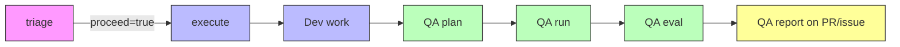

# QA Pipeline

An independent QA track that shadows the `sf-ticket-to-pr` dev workflow. It generates a test plan from the issue requirements and org metadata, runs data and UI tests against the scratch org, and posts a structured QA report — all triggered automatically by the same `@butler` mention.

- [Pipeline](#pipeline)
- [Jobs](#jobs)
- [How QA runs inside execute](#how-qa-runs-inside-execute)
- [Skills](#skills)
- [Type modules](#type-modules)
- [Shared modules](#shared-modules)
- [Artifacts](#artifacts)
- [QA report format](#qa-report-format)
- [Adding a new type](#adding-a-new-type)
- [Configuration](#configuration)

---

## Pipeline



The pipeline runs **2 jobs**: triage and execute. After dev work completes, the execute job runs QA inline — planning, testing, and reporting all happen in the same job using the same scratch org.

---

## Jobs

### triage

Reads the issue thread, decides whether to proceed. Posts a plan comment. Unchanged from the base `sf-ticket-to-pr` workflow.

### execute

Does the dev work, then runs QA inline:

1. **Dev work** — Claude agent implements the ticket against the scratch org
2. **Query org metadata** — shell step greps the triage plan for Salesforce object names, runs `sf sobject describe` + `jq` to extract field metadata to `/tmp/org-metadata.txt`
3. **Generate test plan** (qa-plan) — reads the issue + pre-queried org metadata for field names, generates DT-NNN/ET-NNN scenarios
4. **Pre-install Playwright** — `npm install --no-save playwright`
5. **Generate frontdoor URL** — `sf org open --url-only` + `sf org display` for instance URL
6. **Run QA tests** (qa-run, 75 max-turns) — data tests via SOQL (batched), E2E via Playwright Node.js scripts (copy-paste templates)
7. **Evaluate and post QA report** (qa-eval, 30 max-turns) — reads results, classifies failures, posts report
8. **Upload screenshots** — as GitHub Actions artifacts

QA failures are **advisory** — they produce warning annotations but don't fail the execute job. The job only fails if dev work failed.

---

## How QA runs inside execute

### Test Planning (qa-plan step)

A shell step greps the triage plan for Salesforce object names (standard + custom `__c`) and runs `sf sobject describe` with `jq` to extract field metadata to `/tmp/org-metadata.txt`. The qa-plan agent reads this file for field API names, types, and picklist values. The issue description defines *what* to test (business logic). The org metadata provides *exact field names and types* so scenarios are precise.

Falls back to issue-text-only planning if the metadata file is empty.

### Data tests (Phase 1)

Creates test data via `sf data create record`, triggers automations via DML, and asserts outcomes via SOQL queries. Fast (~2-5 seconds per scenario). Covers happy path, negative cases, boundary conditions, and bulk (200 records).

### E2E tests (Phase 2)

The agent writes a **single Node.js Playwright script** that:
- Launches Chromium at `/usr/bin/chromium` (pre-installed on the runner)
- Authenticates **once** via the pre-generated frontdoor URL
- Navigates directly to record pages using `${instanceUrl}/lightning/r/<Object>/<Id>/view`
- Reuses record IDs from Phase 1 data tests (no redundant record creation)
- Uses proven patterns from type-specific `run.md` modules for Lightning wait strategies
- Wraps each scenario in try/catch (failures don't abort remaining scenarios)
- Captures screenshots to `/tmp/qa-screenshots/`

Playwright MCP is **not used in CI** — `mcp_servers: []` on every run due to an OAuth token limitation in `claude-code-action`. The `.claude/mcp.json` config remains for local development only.

### Evaluation (separate invocation)

A second `claude-code-action` invocation (qa-eval, 30 max-turns) reads `/tmp/qa-results.json`, classifies failures by root cause using type-specific eval modules, generates the QA report, and posts it. This separation guarantees the report is posted even if Phase 1+2 exhausted the qa-run turn budget.

Results are written incrementally — if qa-run is interrupted, qa-eval receives all completed scenarios.

### Labels

- **`qa-findings`**: Applied when any test fails. Removed when all pass on re-run.
- **`qa-fix-needed`**: Applied when failures have code-level root causes (not environment/flakiness). Signals to humans that a re-trigger of `@butler` may fix the issue.

---

## Skills

| Skill | What it does |
|---|---|
| [qa-plan](.claude/skills/qa-plan/SKILL.md) | Reads issue requirements, detects SF metadata types, queries org for field metadata, loads type-specific patterns, generates a test plan with DT-NNN (data) and ET-NNN (e2e) scenarios. |
| [qa-run](.claude/skills/qa-run/SKILL.md) | Executes the test plan against the scratch org. Phase 1: data tests via SOQL/API. Phase 2: e2e tests via Playwright Node.js scripts with screenshots. Outputs pass/fail per scenario. |
| [qa-eval](.claude/skills/qa-eval/SKILL.md) | Evaluates results using type-specific root cause patterns, generates the QA report, posts to PR/issue, manages `qa-findings` and `qa-fix-needed` labels. |

---

## Type modules

Each supported Salesforce metadata type has 4 module files in `.claude/skills/_qa-types/<type>/`:

| Module | Phase | Purpose |
|--------|-------|---------|
| `plan.md` | qa-plan | Test scenario patterns, boundary conditions, subtypes |
| `data.md` | qa-run Phase 1 | Test data creation, DML triggers, bulk patterns |
| `run.md` | qa-run Phase 1+2 | SOQL assertions, Playwright patterns for Lightning interactions |
| `eval.md` | qa-eval | Root cause categories, severity defaults, fix suggestions |

### Supported types

| Type | Directory | Testing focus |
|------|-----------|---------------|
| **Flow** | `_qa-types/flow/` | Record-triggered DML, field updates, child record creation, bulk (200 records), boundary conditions, before/after save |
| **Prompt Template** | `_qa-types/prompt-template/` | API invocation, merge field resolution, output quality, empty/null inputs, format compliance |
| **Agentforce** | `_qa-types/agentforce/` | Topic routing, action invocation, multi-turn conversations, guardrails, context grounding, escalation |

---

## Shared modules

Located in `.claude/skills/_qa-shared/`:

| Module | Purpose |
|--------|---------|
| [type-detection.md](.claude/skills/_qa-shared/type-detection.md) | Keyword matching rules to infer metadata types from issue text. Handles ambiguity (e.g., "Agent" only maps to Agentforce if co-occurring with "topic" or "action"). |
| [type-registry.md](.claude/skills/_qa-shared/type-registry.md) | Maps type names to module paths. Used by all skills to locate type-specific logic. |
| [sf-assertions.md](.claude/skills/_qa-shared/sf-assertions.md) | Reusable SOQL assertion patterns: record exists, field changed, record count, related records, negative tests. |
| [sf-reporting.md](.claude/skills/_qa-shared/sf-reporting.md) | QA report Markdown template, artifact link instructions for screenshots, `qa-findings` and `qa-fix-needed` label logic. |

---

## Artifacts

| Artifact | Produced by | Contents | Retention |
|----------|-------------|----------|-----------|
| `qa-screenshots` | execute (QA phase) | PNG screenshots from Playwright e2e tests (one per assertion point) | 30 days |

Screenshots are downloadable from the GitHub Actions run page. The QA report links to the Actions artifacts page (not relative paths).

---

## QA report format

```markdown
## QA Report — Issue #42

**Result**: PASS | **Pass rate**: 12/12 (100%)

### Data Tests
| # | Scenario | Result | Details |
|---|----------|--------|---------|
| DT-001 | Owner task created on Closed Won | PASS | Subject, OwnerId, ActivityDate all match |
| DT-005 | Amount = $100K — no VP task | PASS | Exactly 1 task, GreaterThan excludes $100K |

### E2E Tests

Screenshots available in the [Actions artifacts](https://github.com/owner/repo/actions/runs/12345)

| # | Scenario | Result | Screenshot | Details |
|---|----------|--------|------------|---------|
| ET-001 | Happy path — task visible in UI | PASS | see artifacts | Activity timeline shows task |

### Failures
_(only present if tests failed)_

#### Root Cause 1: Missing entry criteria
**Severity**: High
**Scenarios**: DT-003, DT-007
**Summary**: Flow did not fire — entry condition doesn't match test record
**Evidence**: SOQL returned 0 Tasks after DML update
```

When failures exist, the issue is labeled `qa-findings`. When code-level failures exist, the issue is also labeled `qa-fix-needed`. When all tests pass on a subsequent run, both labels are removed.

---

## Adding a new type

1. **Create the module directory**:
   ```
   .claude/skills/_qa-types/<type-key>/
   ├── plan.md    # Scenario patterns for qa-plan
   ├── data.md    # Test data creation for qa-run Phase 1
   ├── run.md     # Assertions + Playwright patterns for qa-run
   └── eval.md    # Root cause categories for qa-eval
   ```

2. **Add detection keywords** to [type-detection.md](.claude/skills/_qa-shared/type-detection.md) — list the primary keywords, context rules, and ambiguity handling for the new type.

3. **Register the type** in [type-registry.md](.claude/skills/_qa-shared/type-registry.md) — add a row to the registry table with the type key and module path.

4. **Test it** — create an issue mentioning the new type, trigger `@butler`, and verify qa-plan detects the type and generates appropriate scenarios.

Use the existing Flow modules as a reference — they're the most complete example.

---

## Configuration

All configuration is in [.github/workflows/sf-ticket-to-pr.yml](.github/workflows/sf-ticket-to-pr.yml).

| Setting | Location | Current value |
|---------|----------|---------------|
| Model (qa-plan) | "Generate test plan" step `claude_args` | `claude-sonnet-4-6` |
| Model (qa-run) | "Run QA tests" step `claude_args` | `claude-sonnet-4-6` |
| Model (qa-eval) | "Evaluate and post QA report" step `claude_args` | `claude-sonnet-4-6` |
| Max turns (qa-plan) | "Generate test plan" step `claude_args` | 15 |
| Max turns (qa-run) | "Run QA tests" step `claude_args` | 75 |
| Max turns (qa-eval) | "Evaluate and post QA report" step `claude_args` | 30 |
| Screenshot retention | "Upload QA screenshots" step `retention-days` | 30 days |

### Cost

Each `@butler` mention triggers up to 4 Claude invocations:

| Invocation | Typical cost | Tokens |
|-----------|-------------|--------|
| triage | ~$0.10 | ~200K |
| execute (dev) | ~$2.50 | ~5M |
| execute (qa-plan) | ~$0.20 | ~200K |
| execute (qa-run) | ~$1.50 | ~3M |
| execute (qa-eval) | ~$0.25 | ~400K |
| **Total** | **~$4.55** | **~8.8M** |

Costs vary by issue complexity. The triage job is cheap — if it refuses or asks for clarification, only ~$0.10 is spent. QA costs are only incurred if dev work succeeds.

### Architecture decisions

| Decision | Rationale |
|----------|-----------|
| QA inline in execute (2-job pipeline) | Reuses the same scratch org. qa-plan gets org access for metadata queries. No artifact polling needed. |
| Pre-query org metadata in shell step | Shell steps have no permission restrictions. Greps triage plan for object names, runs `sf sobject describe` + `jq`. Agent reads the file — no permission issues, saves turns. |
| Split qa-run and qa-eval into two invocations | Guarantees the report is always posted. qa-run can exhaust turns on E2E without losing the report. |
| Playwright via Node.js scripts (not MCP) | MCP server never starts in `claude-code-action` with OAuth tokens (`mcp_servers: []`). Scripts are reliable and deterministic. |
| Copy-paste Playwright templates in skill modules | Agent copies a complete, runnable script template from `run.md`, fills in the scenario array. Eliminates setup debugging (chromium path, imports, wait strategies). |
| Batched data test operations | Agent creates all test records first, then runs all assertions. Reduces ~4 turns per scenario to ~2-3 turns. |
| Pre-generate frontdoor URL in shell step | `sf org open` is not in the agent's permission set. Shell steps have no restrictions. |
| Screenshot links to Actions artifacts | Relative paths don't work in issue comments. Artifact page URLs work everywhere. |
| Single browser session for all E2E scenarios | One login instead of N. Direct record URLs instead of UI navigation. ~30% faster. |
| Incremental result writing | qa-run overwrites `/tmp/qa-results.json` after each scenario. Partial results survive interruptions. |
| `qa-fix-needed` label for code-level failures | Distinguishes actionable bugs from environment flakiness. Humans decide whether to re-trigger `@butler`. |
